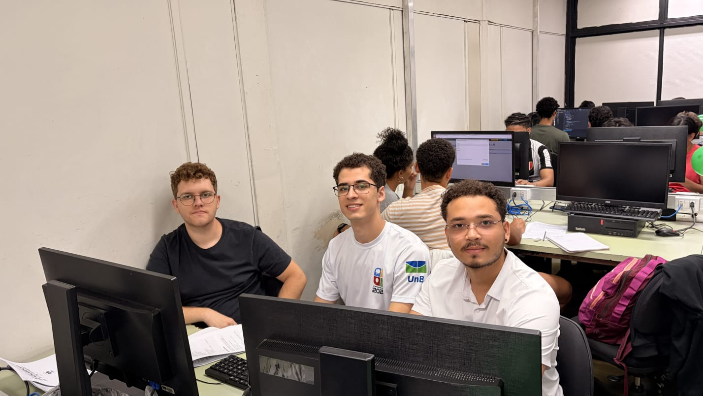
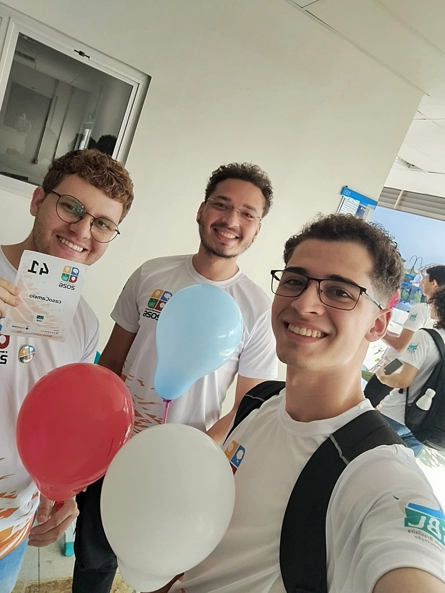

# UnB — Competitive Programming

> 100+ problems solved · 5 languages · 6 disciplines · 3 programming marathons

Collection of competitive programming solutions and coursework problems solved throughout my Computer Engineering degree at the University of Brasília (UnB), hosted on the university's online judge.

## Disciplines

| Discipline                              | Problems |
|-----------------------------------------|----------|
| Algorithms & Computer Programming (APC) | 20       |
| Data Structures 1 (EDA1)                | 45       |
| Data Structures 2 (EDA2)                | 39       |
| Computer Architecture (FAC)             | 10       |
| Operating Systems Fundamentals (FSO)    | 7        |
| Compilers 1                             | 28       |

## 🏆 Programming Marathons

| Event                          | Edition | Date     |
|--------------------------------|---------|----------|
| UnB Programming Marathon       | XIII    | Nov 2025 |
| Cerrado Programming Marathon   | II      | May 2026 |
| UnBalloon Programming Marathon | VII     | May 2026 |

### Team

